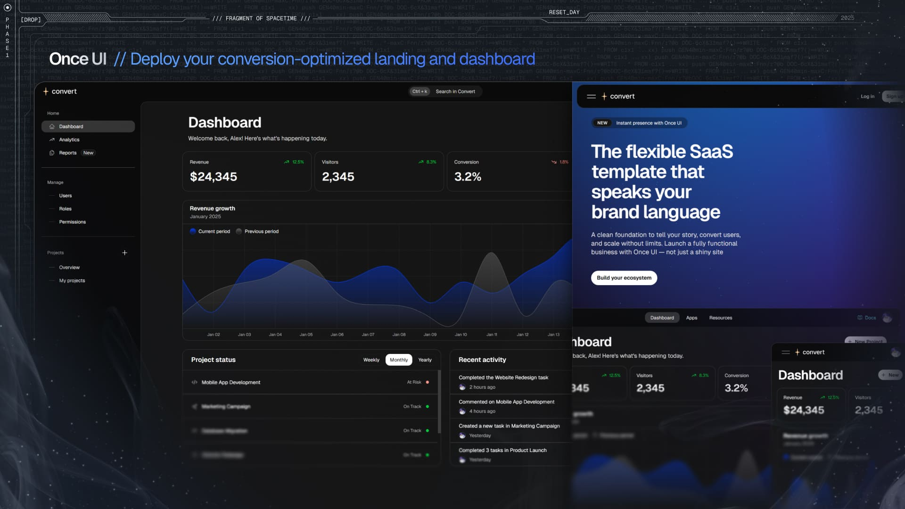

# Magic Agent

A chatbot UI with a minimal landing page setup. The chat messages are automatically converted to MDX and rendered as Once UI native components.

Just add your OpenAI API key in `.env.local` and you're good to go!

## Features

* **Chat**: A responsive chat interface with auto-scrolling and code view.
* **Landing page**: A minimal landing page setup.
* **Customization**: Manage design config in a single file.
* **Components**: Access Once UI components with simple APIs.
* **SEO**: Enjoy a simplified SEO setup with a single source of truth for meta details.
* **PRO**: Seamlessly integrate elements from other Once UI products and our Block library.

## Demo

Check the [demo app](https://agent.once-ui.com).

## Documentation

Read the documentation at [docs.once-ui.com](https://docs.once-ui.com/magic-agent/quick-start).

## Combine with other products

[Magic Store](https://once-ui.com/products/magic-store) (PRO): Our premium ecommerce storefront that lets you launch your merch store in minutes. Payment, production and shipping managed by Fourthwall.

[Magic Docs](https://once-ui.com/products/magic-docs) (PRO): Our premium documentation generator. Just add your MDX files and let Magic Docs handle the rest.

[Once UI Blocks](https://once-ui.com/blocks) (PRO): Copy-paste pre-designed blocks and deploy fully-functional sites with lightning speed.

## Creators

Connect with us!

**Lorant One**: [Site](https://lorant.one) / [Threads](https://www.threads.net/@lorant.one) / [LinkedIn](https://www.linkedin.com/in/lorant-one/)

## Become a Oncer

Join the [Design Engineers Club](https://discord.com/invite/5EyAQ4eNdS) on Discord to connect with us and share your projects.

# License

TL;DR: Access to Magic Agent under Once UI Pro allows personal/internal use and modifications, but prohibits SaaS, resale, redistribution, and public sharing.

See `LICENSE.txt` for more information.